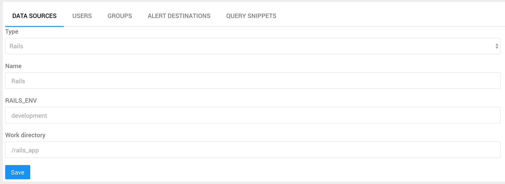
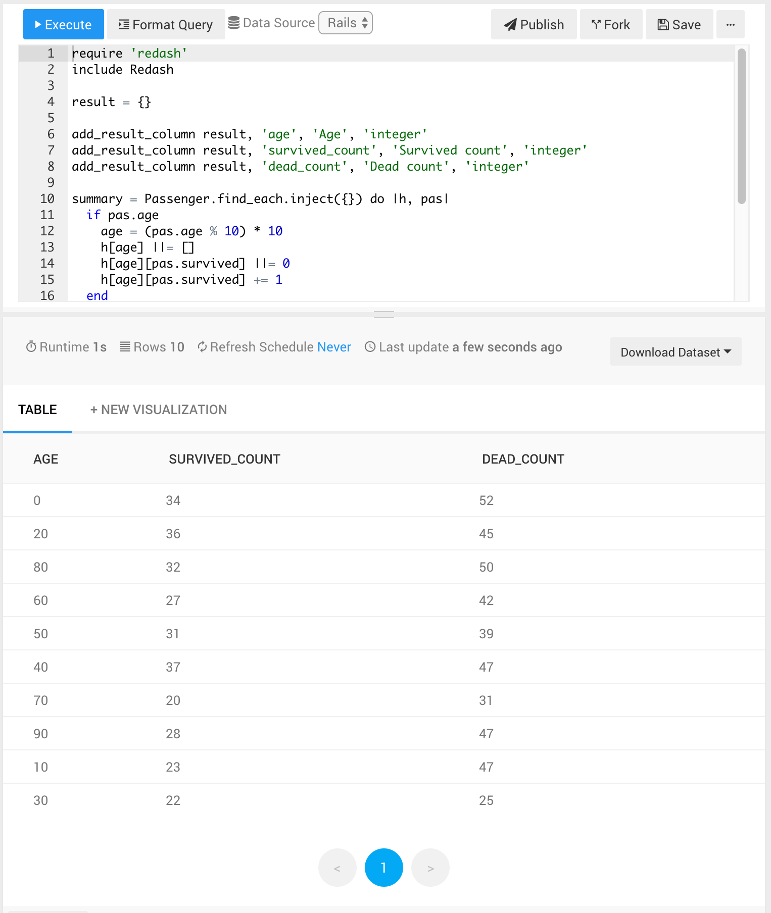

# Redash and rails integration demo

## 1. Launch redash

```console
$ docker-compose build
$ docker-compose up
```

## 2. Create Rails datasource



## 3. Create a new query and execute it

```ruby
require 'redash'
include Redash

result = {}

add_result_column result, 'age', 'Age', 'integer'
add_result_column result, 'survived_count', 'Survived count', 'integer'
add_result_column result, 'dead_count', 'Dead count', 'integer'

summary = Passenger.find_each.inject({}) do |h, pas|
  if pas.age
    age = (pas.age % 10) * 10
    h[age] ||= []
    h[age][pas.survived] ||= 0
    h[age][pas.survived] += 1
  end
  h
end

summary.each do |age, age_summary|
  add_result_row(result, age: age, survived_count: age_summary[1], dead_count: age_summary[0])
end

commit_to_redash(result)
```


